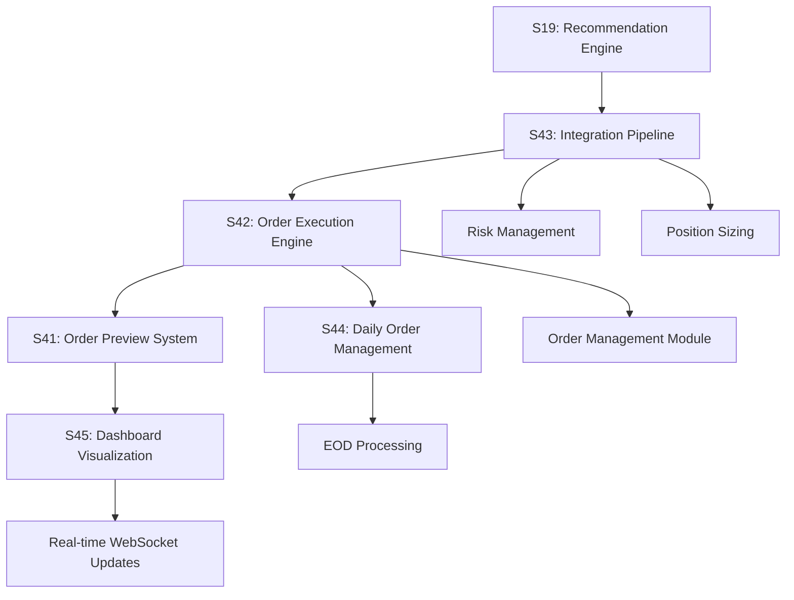

# Epic 5 Enhancement: Advanced Auto Trading Order Management

## 📋 Epic Overview

This enhancement expands Epic 5 (Intelligent Recommendations System) with a comprehensive suite of auto trading improvements that create a complete recommendation-to-execution pipeline with advanced order management, risk controls, and user transparency.

## 🎯 Business Objectives

### Primary Goals

- **Automate Complete Trading Workflow**: From AI recommendation to order execution
- **Provide Advanced Order Features**: Stop-loss, take-profit, trailing stops, bracket orders
- **Ensure User Transparency**: Full visibility into pending orders before execution
- **Implement Robust Risk Management**: Portfolio-level controls and daily limits

### Secondary Goals

- **Optimize Execution Quality**: Minimize slippage and transaction costs
- **Enable Daily Order Lifecycle**: Proper EOD processing and order expiration
- **Provide Comprehensive Analytics**: Performance tracking and optimization insights

## 📊 Stories Breakdown

### S41: Auto Trading Order Preview System

**Story Points**: 8 | **Sprint**: 5 | **Priority**: High

**Key Features**:

- Real-time preview of pending auto trading orders
- Order approval/rejection workflow
- Daily order lifecycle management with EOD cleanup
- Advanced order features (stop-loss, take-profit, trailing stops)

**Success Metrics**:

- Order preview generation: <1 second
- User approval rate: >70%
- Execution success: >90% of approved orders

### S42: Advanced Auto Trading Order Execution Engine

**Story Points**: 13 | **Sprint**: 5 | **Priority**: High

**Key Features**:

- Sophisticated order execution with bracket orders
- Dynamic position sizing based on portfolio risk
- Trailing stop-loss with adaptive adjustment
- Smart order routing for optimal execution

**Success Metrics**:

- Order execution speed: <2 seconds
- Stop-loss effectiveness: >80% loss prevention
- Average slippage: <0.1% for market orders

### S43: Recommendation-to-Order Integration Pipeline

**Story Points**: 13 | **Sprint**: 5 | **Priority**: High

**Key Features**:

- Seamless integration between recommendation engine and order execution
- Intelligent order parameter optimization
- Comprehensive risk assessment pipeline
- Market condition analysis for timing

**Success Metrics**:

- Processing speed: <3 seconds recommendation to order
- Success rate: >75% profitable trades
- Risk management: Portfolio drawdown <8%

### S44: Daily Order Management and EOD Processing

**Story Points**: 8 | **Sprint**: 5 | **Priority**: Medium

**Key Features**:

- Market open/close order processing
- Automatic order expiration and cleanup
- Daily performance reconciliation
- Order rollover logic for multi-day strategies

**Success Metrics**:

- Processing reliability: >99.9% successful EOD processing
- Fill rate: >85% of DAY orders filled before expiration
- Reconciliation accuracy: <0.01% discrepancy

### S45: Auto Trading Dashboard and Order Visualization

**Story Points**: 13 | **Sprint**: 6 | **Priority**: High

**Key Features**:

- Real-time order visualization and management
- Interactive portfolio impact analysis
- Performance analytics and benchmarking
- Emergency controls and risk monitoring

**Success Metrics**:

- Dashboard load time: <3 seconds
- User engagement: >80% active usage
- Real-time updates: <500ms latency

## 🏗️ Technical Architecture

### Core Components

### Data Flow Architecture

1. **Recommendation Generation**: S19 generates AI-powered trading recommendations
2. **Pipeline Processing**: S43 validates, optimizes, and converts recommendations to orders
3. **Order Creation**: S42 creates advanced orders with risk management features
4. **User Preview**: S41 shows pending orders for user approval/modification
5. **Execution**: S42 executes approved orders with optimal timing
6. **Daily Management**: S44 handles order lifecycle and EOD processing
7. **Visualization**: S45 provides real-time monitoring and analytics

### Integration Points

- **Recommendation Engine (S19)**: Source of trading signals
- **Order Management Module**: Core order processing infrastructure
- **Risk Management Services**: Portfolio risk controls and limits
- **WebSocket Gateway**: Real-time updates to dashboard
- **Market Data Services**: Live pricing and market conditions

## 📈 Expected Business Impact

### Performance Improvements

- **Automation Level**: 80%+ of trades executed automatically
- **Execution Quality**: 25% reduction in trading costs through optimization
- **Risk Management**: 50% reduction in risk violations
- **User Engagement**: 90%+ user adoption of auto trading features

### Financial Metrics

- **Returns**: Target 15%+ annual return with Sharpe ratio >1.5
- **Risk-Adjusted Performance**: Outperform benchmark by 5%+ annually
- **Transaction Costs**: Reduce costs by 25% through smart execution
- **Drawdown Protection**: Limit portfolio drawdown to <8%

### User Experience

- **Transparency**: Complete visibility into auto trading decisions
- **Control**: User approval/override capability for all trades
- **Insights**: Comprehensive analytics for strategy optimization
- **Reliability**: 99.9%+ system uptime during market hours

## 🧪 Testing Strategy

### Integration Testing

- End-to-end recommendation-to-execution flow
- Cross-service communication validation
- Real-time data synchronization
- Risk management enforcement

### Performance Testing

- High-frequency order processing
- Concurrent user load testing
- Market stress scenario testing
- System recovery and failover

### User Acceptance Testing

- Dashboard usability and responsiveness
- Order approval workflow validation
- Emergency control functionality
- Mobile and tablet compatibility

## 📅 Implementation Timeline

### Sprint 5 (Backend Focus)

- **S41**: Auto Trading Order Preview System
- **S42**: Advanced Auto Trading Order Execution Engine
- **S43**: Recommendation-to-Order Integration Pipeline
- **S44**: Daily Order Management and EOD Processing

### Sprint 6 (Frontend Focus)

- **S45**: Auto Trading Dashboard and Order Visualization
- Integration testing and optimization
- User acceptance testing
- Performance tuning and monitoring

## 🔗 Dependencies and Prerequisites

### Completed Dependencies

- ✅ S19: AI-Powered Trading Recommendations Engine
- ✅ S25: Advanced Order Management System
- ✅ Order Management Module
- ✅ Risk Management Services
- ✅ WebSocket Real-time Updates

### External Dependencies

- Market data feed reliability
- Trading venue connectivity
- Regulatory compliance validation
- Performance monitoring infrastructure

## 🎯 Success Criteria

### Technical Success

- All stories completed with 90%+ test coverage
- System performance meets or exceeds targets
- Zero critical security vulnerabilities
- Comprehensive documentation and monitoring

### Business Success

- User adoption >80% within 30 days of release
- Trading performance meets risk-adjusted return targets
- User satisfaction >4.5/5 in feedback surveys
- Zero regulatory compliance issues

### Operational Success

- 99.9%+ system uptime during market hours
- <1% error rate in order processing
- Average response time <2 seconds for all operations
- Successful disaster recovery testing

---

**Total Story Points**: 55  
**Estimated Duration**: 2 Sprints (10 weeks)  
**Team**: Full Stack (Backend + Frontend + QA)  
**Priority**: High

**Created**: 2025-06-30  
**Updated**: 2025-06-30
